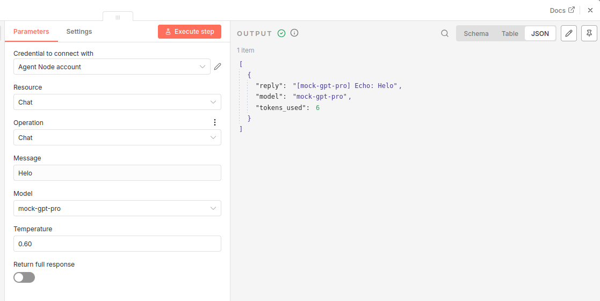
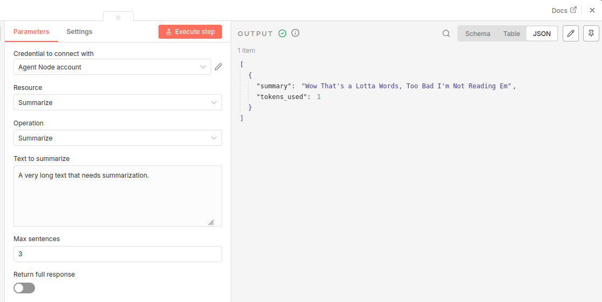
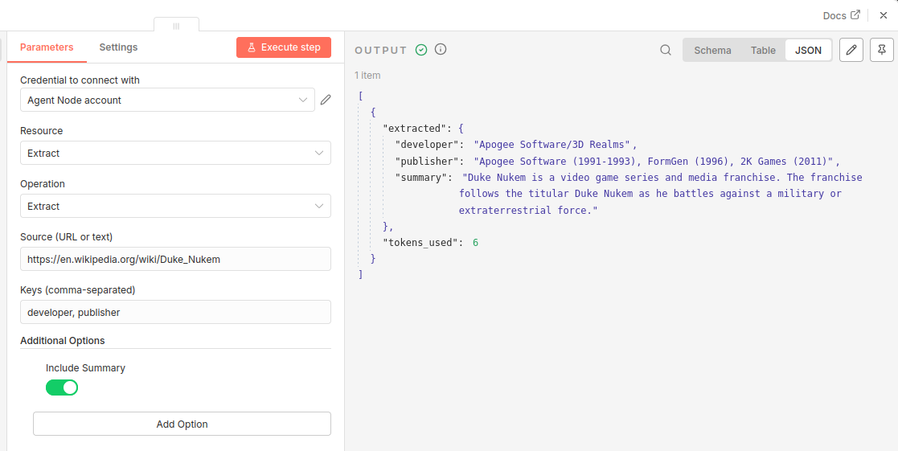
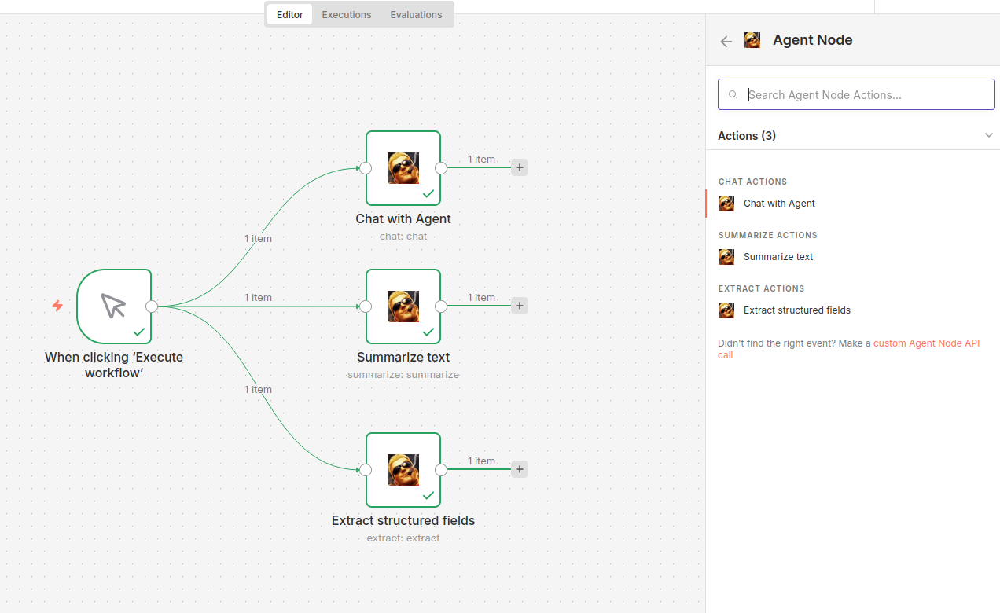

# fastapi_n8n_agent

A FastAPI backend and a custom n8n node workflows.
[Thoughts on architecture.](./developer-notes.md)

## Prequsition

- [docker compose](https://docs.docker.com/compose/)
- [npm](https://www.npmjs.com/)

## Building the custom n8n agent node

```bash
cd agent_node
npm i
npm install n8n -g

cd nodes/AgentNode/
npm run build  # should create agent_node/dist directory
```

The content of `dist` directory can be copied to own n8n instances `n8n/custom` directory.

## Run the project

Run FastAPI backend and localhosted n8n instance.

- `--watch` is supported for hot reloading
- if n8n ran locally the `agent_node/dist` mounted

```bash
docker compose build
docker compose up
```

- **FastAPI backend documentation:** [localhost:8000](localhost:8000)
- **n8n if localhosted:** [localhost:5678](localhost:5678)

If only backend needed use:

- Note: `baseURL` is needed to be updated under `agent_node` from `fastapi:8000` to `localhost:8000`

```bash
docker compose up fastapi
```

## Node resources

All functions are mockup, based on what a "conversational" agent might be able to do. The mockup logic is in [AgentService](backend/app/agent_service.py). Most fields are hardcoded in [models.py](backend/app/models/models.py) and also in [AgentNode.node.ts](agent_node/nodes/AgentNode/AgentNode.node.ts).

### 1. Chat

Mockup chat function. Any user intput will be echoed.

*Options*:
- model
- temperature



### 2. Summarize

Returns the same "summary".

*Options:*
- max sentences



### 3. Extract

"Extracts" field from source.

*Options:*
- the fields can be selected
- include summary


## Demo workflow: [examples/demo_workflow.json](examples/demo_workflow.json)

Importable workflow to an n8n instance, that has the custom node installed.



## Future plans
- **proper AUTH**
    - currently only `/ping` endpoint is called
    - and backend logs the key
- **version locking**
    - n8n version: Dockerfile
    - python libs: pyproject.toml
- fix *Return full response* btn
    - it currently just a UI element
    - maybe inject an extras (tokens, response time, etc.) field into current responses
- better node build pipeline
    - mounting like a volume is not the nicest
    - also i do not think it allows multiple ones at the same time
